<div align="center">

<picture>
  <source media="(prefers-color-scheme: dark)" srcset="assets/banner-dark.svg">
  <source media="(prefers-color-scheme: light)" srcset="assets/banner-light.svg">
  
</picture>

</div>

## `GET /sobre-mi`

<picture>
  <source media="(prefers-color-scheme: dark)" srcset="assets/whoami-dark.svg">
  <source media="(prefers-color-scheme: light)" srcset="assets/whoami-light.svg">
  
</picture>

Desarrollo APIs REST y servicios backend en **Java** y **Go** dentro de una arquitectura de microservicios. También diseño agentes y skills de IA para **Claude**, integro modelos de lenguaje en los procesos del equipo y armo flujos automatizados con **n8n** y **Python**.

Me importa que el software se pueda mantener: tests que cubren lo que importa, decisiones explicadas en el código y monitoreo de lo que corre en producción.

## `GET /stack`

<table>
  <tr>
    <td width="50%" valign="top">
      <code>backend</code><br><br>
      <br>
      <sub>Java · Spring Boot · Go · C# · .NET 8 · Maven · JPA</sub>
    </td>
    <td width="50%" valign="top">
      <code>datos</code><br><br>
      
      <br>
      <sub>PostgreSQL · SQL Server · Sybase · Flyway · stored procedures</sub>
    </td>
  </tr>
  <tr>
    <td valign="top">
      <code>ia_y_automatizacion</code><br><br>
      
      
      <br>
      <sub>Python · LLMs · agentes y skills para Claude · n8n · prompt engineering</sub>
    </td>
    <td valign="top">
      <code>frontend</code><br><br>
      <br>
      <sub>TypeScript · React · Vite · Tailwind CSS</sub>
    </td>
  </tr>
  <tr>
    <td valign="top">
      <code>infra_y_ci</code><br><br>
      <br>
      <sub>Docker · Docker Compose · GitHub Actions · Git · TFS</sub>
    </td>
    <td valign="top">
      <code>observabilidad</code><br><br>
      
      
      <br>
      <sub>Datadog · New Relic · Kibana</sub>
    </td>
  </tr>
  <tr>
    <td colspan="2"><sub><code>forma_de_trabajo: scrum · refinamientos técnicos · tests unitarios, funcionales y de caja negra</code></sub></td>
  </tr>
</table>

## `GET /proyectos/destacado`

<a href="https://github.com/jcaparr/Web-hamburgueseria">
  <picture>
    <source media="(prefers-color-scheme: dark)" srcset="assets/stack-dark.svg">
    <source media="(prefers-color-scheme: light)" srcset="assets/stack-light.svg">
    
  </picture>
</a>

### 🍔 [Hamburgueserías BA](https://github.com/jcaparr/Web-hamburgueseria)

Una web para descubrir, calificar y reseñar las hamburgueserías de Buenos Aires. La hice de punta a punta: backend, frontend, base de datos, deploy y CI.

- **Autenticación propia:** sesiones en cookies HttpOnly con refresh tokens, verificación por email, ingreso con Google y rate limiting con token bucket.
- **Datos reales de Google Places:** más de 1.500 locales, cargados por un proceso programado que recorre CABA y el conurbano, descarta lo que no es una hamburguesería y cuida la cuota de la API.
- **Tour:** arma un recorrido a pie entre hamburgueserías y lo abre en Google Maps.
- **De qué hablan las reseñas:** resume los temas de los comentarios de cada local usando la nota que puso cada persona, sin inventar nada.
- **Social:** feed con paginación por cursor, seguir y bloquear usuarios, perfiles públicos, wishlist y reseñas con foto.

<p>
  <a href="https://github.com/jcaparr/Web-hamburgueseria"></a>
  <a href="https://github.com/jcaparr/Web-hamburgueseria#decisiones-t%C3%A9cnicas"></a>
</p>

### Otros proyectos

- **[SalesCrud](https://github.com/jcaparr/SalesCrud):** API REST de ventas (clientes, productos y ventas) con Spring Boot 3, JPA, DTOs y manejo global de errores.

## `GET /experiencia`

```diff
@@ trabajo @@
+ mar 2025 → hoy     Software Developer · Mercado Libre
  APIs REST y servicios backend en Java y Go, en una arquitectura de microservicios
  Agentes y skills de IA para Claude · automatizaciones con Python y n8n
  Monitoreo con Kibana, Datadog y New Relic · Scrum

+ jun 2024 → 2025    Analista Programador · Accusys Technology
  Procesos batch en .NET 8 para el core bancario COBIS
  Stored procedures sobre Sybase y SQL Server

@@ formación @@
+ 2025 → hoy         Analista Programador · Universidad Abierta Interamericana
  Entity Framework y LINQ · Educación IT (2024)
  WPF con .NET 5 · LinkedIn Learning (2024)
  Maquetador Web HTML5 y CSS3 · Educación IT (2022)
  Inglés B2
```

## `GET /actividad`

<picture>
  <source media="(prefers-color-scheme: dark)" srcset="https://raw.githubusercontent.com/jcaparr/jcaparr/output/snake-dark.svg">
  <source media="(prefers-color-scheme: light)" srcset="https://raw.githubusercontent.com/jcaparr/jcaparr/output/snake-light.svg">
  
</picture>

## `POST /contacto`

<p>
  <a href="https://www.linkedin.com/in/juanmartincaparros"></a>
  <a href="https://github.com/jcaparr"></a>
</p>

<div align="center">
<sub>Hecho en Buenos Aires · servido caliente 🍔</sub>
</div>
